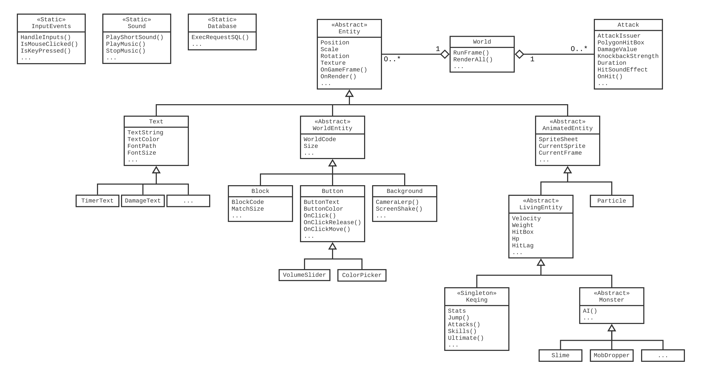

# KeqEngine

**KeqEngine** is a custom-built 2d game engine designed specifically for creating fighting games (e.g. [Hack'N Slash](https://fr.wikipedia.org/wiki/Hack_%27n%27_slash)). The engine is centered around the character [Keqing](#keqing-video), who comes with dozens of unique skills.

https://github.com/user-attachments/assets/58355315-8059-47bc-87ad-17586ba1448f

## Game Engine

### Feature List

- **Rendering** (Scene Display, Sprite Animation, Window Resizing...)
- **Camera** (Camera Lerping, Screen Shaking)
- **Entity Component System**
- **Physics** (Velocity, Gravity...)
- **Collision Detection System**
- **Particle System**
- **Attack System** (Polygon Collision, Knock-Backs...)
- **User Interface** (Text, Button, Slider, Color-Picker...)
- **Input Events** (Mouse, Keyboard)
- **Audio** (Sound Effects, Background Music)
- **Data Storage**
- **Debugging System** (HitBox Display, Frame-by-Frame Execution)

### KeqEngine UML Diagram



### Keqing Preview

https://github.com/user-attachments/assets/b05b047d-c2dc-42b4-a2f9-c0d1f239cdd1

### Game Example

Check out [```src/Main/```](src/Main/) for a complete example of how to use KeqEngine to create a game.

- **ExploSlime Game**

https://github.com/user-attachments/assets/87ab9ec2-87d0-4333-b0a9-7aa8abcfe14c

## Development Set-Up

<div align="center">

[](https://isocpp.org/)
&nbsp;&nbsp;&nbsp;&nbsp;
[](https://www.jetbrains.com/clion/)
&nbsp;&nbsp;&nbsp;&nbsp;
[](https://www.microsoft.com/windows/)

[SDL2](https://www.libsdl.org/) \
[Boost](https://www.boost.org/) \
[SQLite3](https://www.sqlite.org/)

</div>

### How To Use

- Run w/ CLion.

---

<div align="center">
  Copyright &#169; 2024 PyroWilDx. All Rights Reserved.
</div>
